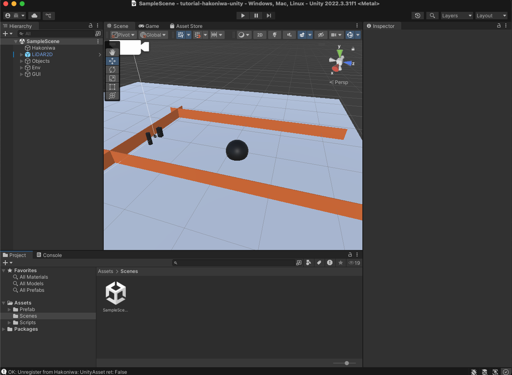
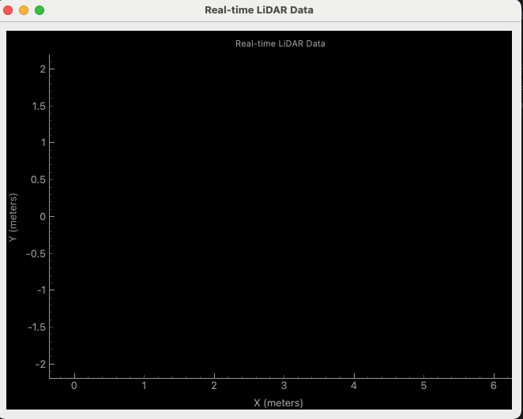
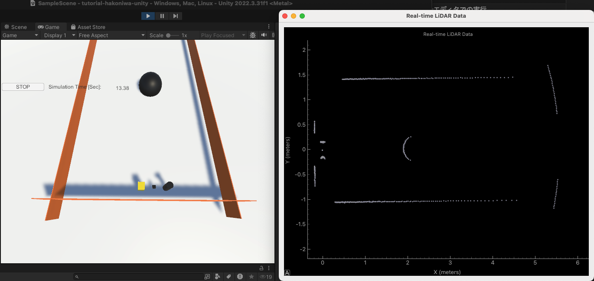

# tutorial-hakoniwa-unity

このリポジトリでは、[箱庭Unityフレームワーク](https://github.com/toppers/hakoniwa-sim-csharp)のチュートリアルを行います。

題材はLiDARセンサ(下図)で、箱庭アセットとして組み込む方法を解説します。


# サポート環境

- Windows 10/11
- MacOS(Apple Silicon)

# 環境構築

## Unityのインストール

[Unity Hub](https://unity3d.com/jp/get-unity/download)からUnity Hubをダウンロードし、Unity Hubを使ってUnityをインストールします。

## 箱庭コア機能のインストール

以下のサイトを参照して、箱庭コア機能をインストールします。

[箱庭コア機能](https://github.com/toppers/hakoniwa-core-cpp-client)

Windowsの場合は、RAMDISKの設定などが必要です。

以下のサイトが参考になります。

https://github.com/toppers/hakoniwa-px4sim/blob/main/docs/manual/windows_preinstall.md

## 本リポジトリのクローン

以下のコマンドで、本リポジトリをクローンします。

```bash
git clone https://github.com/tmori/tutorial-hakoniwa-unity.git
```

## Unityエディタの起動

Unity Hubを起動し、本リポジトリをクローンしたディレクトリを指定してプロジェクトを開きます。

Unityエディタで、`Assets/Scenes/SampleScene`を開きます。

成功するとこうなります。



# シミュレーション実行方法

## 箱庭コア機能の起動

端末を開き、hakonwia-core-cpp-clientのディレクトリに移動します。

以下のコマンドで、箱庭コア機能を起動します。

```bash
cd examples/unity_lidar
```

```bash
python lidar.py custom.json
```

成功すると、以下のGUIが表示されます。



## Unityエディタでの実行

Unityエディタの再生ボタンを押すと、シミュレーションが開始され、LiDARセンサのデータが表示されます。



# 操作方法

Unity画面上で、以下の操作が可能です。

- 視点の変更
  - マウスのドラッグで視点を変更
  - マウスのスクロールでズームイン/アウト
- 障害物の移動
  - タブキーを押すと、障害物が選択されます。選択されると黄色くなります。
  - 矢印キーで障害物を移動できます。
- 障害物のサイズ変更
  - Eキーを押すと、障害物が拡大します。
  - Qキーを押すと、障害物が縮小します。

# 参考リンク

- [箱庭でLiDARスペックをビジュアライズしてみた](https://qiita.com/kanetugu2018/items/56e9ba90e2d32dad76cb)


